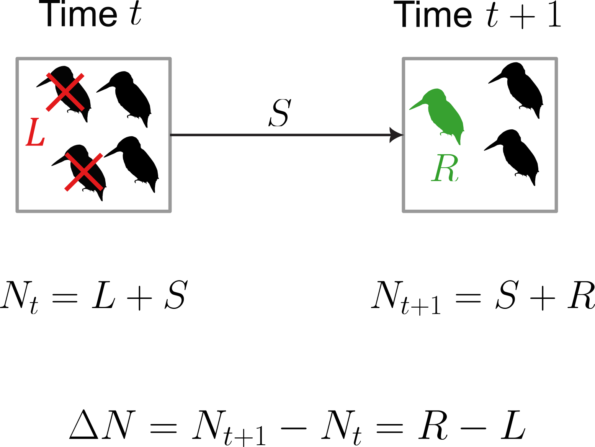
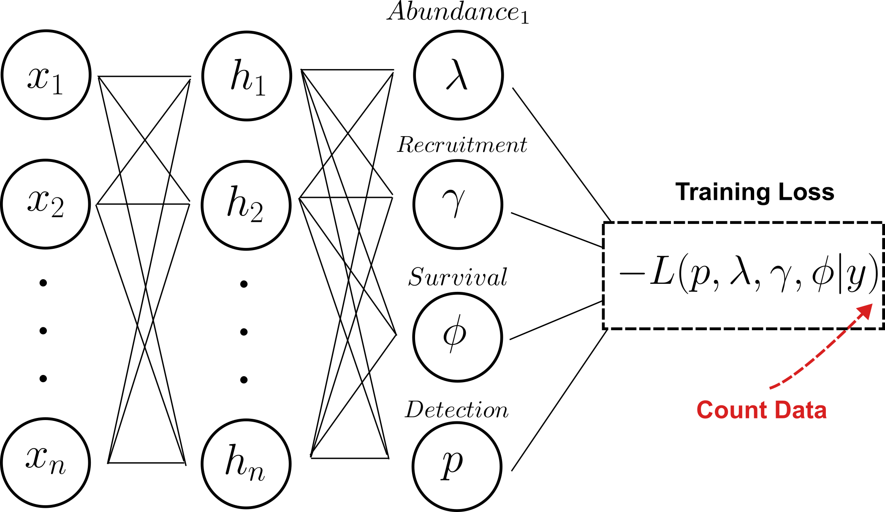
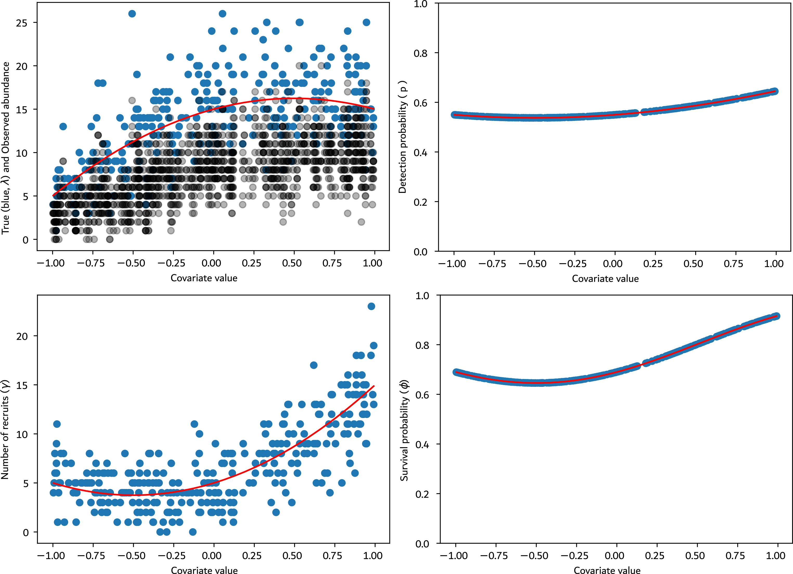
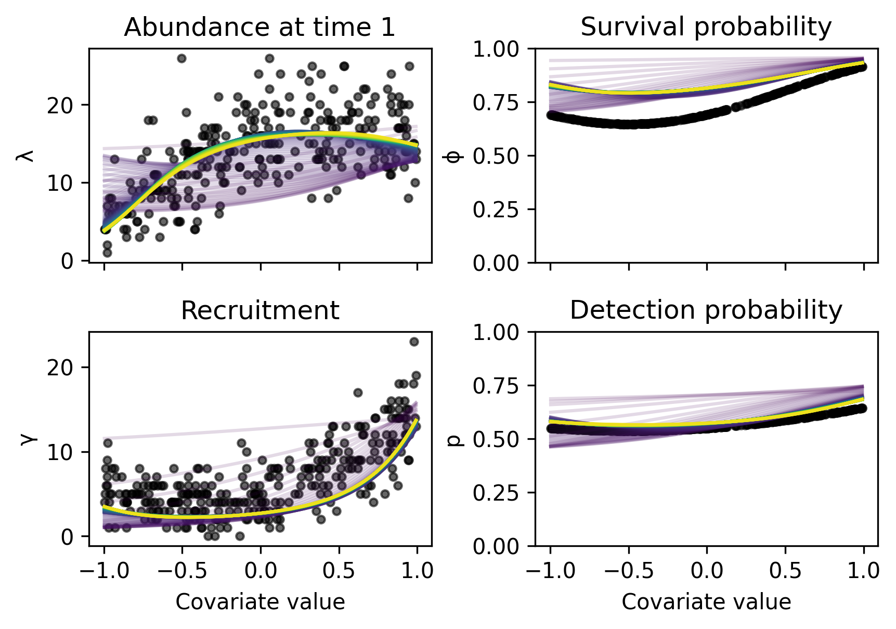

```{r, echo=F}
knitr::opts_chunk$set(message = F, 
                      warning = F,
                      echo = F)
```


# Beyond abundance change

<!-- <div class="center" style="margin:0;"> -->
<!--   <h2 style="margin:0 0 0em; line-height:1.05; display:inline-block;"> -->
<!--     Demographic rates -->
<!--   </h2> -->
<!-- </div> -->

<!-- .pull-left[ -->

<!-- * Changes in abundance are valuable, but demographic mechanisms offer deeper ecological insights -->

<!-- * Species' extinctions event are the result of increasing difference between recruitment and loss -->

<!-- * Changes in demographic rates can be early warnings of species extinction  -->

<!-- * Monitoring survival and recruitment can help tailoring efficient conservation policies -->

<!-- ] -->

<!-- .pull-right[ -->

<!-- <br><br> -->

<!-- ```{r} -->
<!--  -->
<!-- ``` -->


<!-- ] -->


<!-- --- -->

<!-- # Beyond abundance change -->

<!-- <div class="center" style="margin:0;"> -->
<!--   <h2 style="margin:0 0 0em; line-height:1.05; display:inline-block;"> -->
<!--     Problem -->
<!--   </h2> -->
<!-- </div> -->

<!-- .pull-left[ -->


<!-- * Data for demographic rates models are per individual (i.e. *individual encounter history data*) -->

<!-- * They are costly in resources and time -->

<!-- * Individual identification is not equal for all taxa -->

<!-- * Can be invasive/traumatic -->

<!-- * Limited spatial and temporal extent -->

<!-- ] -->

<!-- .pull-right[ -->

<!-- <div style="margin-right:-3.5em"> -->

<!-- ```{r, out.width="100%"} -->
<!-- knitr::include_graphics("images/slide2.png") -->
<!-- ``` -->

<!-- ] -->

<!-- --- -->

<!-- # Beyond abundance change -->

<!-- <div class="center" style="margin:0;"> -->
<!--   <h2 style="margin:0 0 0em; line-height:1.05; display:inline-block;"> -->
<!--     Using abundance to infer demographic rates -->
<!--   </h2> -->
<!-- </div> -->

<!-- .pull-left[ -->

<!-- * However, abundance data are available at large spatial and temporal scale -->

<!-- * The idea of inferring birth/immigration ($\mu$) and death/emigration ($\lambda$) from experimental data is not new -->

<!-- * While overall change in abundance gives information about $\lambda-\mu$, the volatility of the time-series provide information about $\lambda+\mu$ making $\lambda$ and $\mu$ identifiable -->

<!-- ] -->

<!-- .pull-right[ -->

<!-- <br> -->

<!--  -->


<!-- ] -->

<!-- .footnote[Wilkinson, 2011] -->

<!-- --- -->

<!-- # Dynamic N-mixture model -->

<!-- <div class="center" style="margin:0;"> -->
<!--   <h2 style="margin:0 0 0em; line-height:1.05; display:inline-block;"> -->
<!--     Hidden Markov Model -->
<!--   </h2> -->
<!-- </div> -->

<!-- **Observation process** -->

<!-- .pull-left[ -->

<!-- $$y_{i,j,t} \sim Binomial(N_{i,t}, p)$$ -->

<!-- ] -->

<!-- .pull-right[ -->

<!-- $y =$ observed abundance<br> -->
<!-- $N_{it} =$ latent "true" abundance<br> -->
<!-- $p =$ detection probability -->

<!-- ] -->

<!-- .footnote[Dail & Madsen, 2011] -->

<!-- -- -->

<!-- **State process** -->

<!-- .pull-left[ -->

<!-- $$N_{i,1} \sim Poisson(\lambda)$$ -->
<!-- <br> -->

<!-- $$S_{i,t+1} \sim Binomial(N_{i,t}, \phi_{i,t})\\ -->
<!-- R_{i,t+1} \sim Poisson(\gamma_{i,t})\\ -->
<!-- N_{i,t+1} = S_{i,t+1} + R_{i,t+1}$$ -->

<!-- ] -->

<!-- .pull-right[ -->

<!-- $\lambda =$ abundance at $t = 1$ -->

<!-- <br> -->

<!-- $\phi =$ survival probability<br> -->
<!-- $\gamma =$ number of recruits -->
<!-- ] -->

<!-- .footnote[Dail & Madsen, 2011] -->

<!-- --- -->

<!-- # Limitations of Existing Frameworks -->

<!-- .pull-left[ -->

<!-- **Limitations of hierarchical framework** -->

<!-- * Linear or simple polynomial effects of covariates, even though true ecological responses are often unknown *a priori* -->

<!-- * MCMC algorithm scales poorly because inherently sequential, little possibility of parallelization -->

<!-- * Sensitive to priors and initial values -->

<!-- ] -->

<!-- .pull-right[ -->

<!-- **Limitations of Neural Networks** -->

<!-- * Usually lack inferential power, making it less relevant for ecological insights -->

<!-- * Doesn't distinguish between ecological process and imperfect detection -->

<!-- ] -->

<!-- -- -->

<!-- .center[ -->

<!-- ```{r, out.width="70%"} -->
<!-- knitr::include_graphics("images/joseph.png") -->
<!-- ``` -->

<!-- ] -->

<!-- --- -->

<!-- # Neural hierarchical model -->

<!-- .center[ -->

<!-- ```{r, out.width="90%"} -->
<!-- knitr::include_graphics("images/joseph.png") -->
<!-- ``` -->

<!-- ] -->

<!-- <br> -->

<!-- * Combines flexibility and scalability of neural networks with the inferential power of hierarchical models -->

<!-- * Combines decades of development in hierarchical modelling for ecological data with the flexibility and predictive power of Neural Networks -->

<!-- * Loss function: tailored from the model's specific Likelihood (i.e. negative log-likelihood) -->

<!-- * Output activation function according to the parameter to infer -->

<!-- --- -->

<!-- # Neural Dynamic N-mixture model -->

<!-- <!-- .footnote[\* Krishnan et al. 2017] --> -->

<!-- <div class="center" style="margin:0;"> -->
<!--   <h2 style="margin:0 0 0em; line-height:1.05; display:inline-block;"> -->
<!--     Hidden Markov Model -->
<!--   </h2> -->
<!-- </div> -->

<!-- .pull-left-narrow[ -->

<!-- <br> -->

<!-- **State process** -->

<!-- $$\begin{align*} -->
<!-- & N_{i,1} \sim Poisson(\lambda) -->
<!-- \end{align*}$$ -->

<!-- <br> -->

<!-- $$\begin{align*} -->
<!-- & R_{i,t+1} \sim Poisson(\gamma_{i,t})\\ -->
<!-- & S_{i,t+1} \sim Binomial(N_{i,t}, \phi_{i,t})\\ -->
<!-- & N_{i,t+1} = S_{i,t+1} + R_{i,t+1} -->
<!-- \end{align*}$$ -->


<!-- **Observation process** -->

<!-- $$\begin{align*} -->
<!-- & y_{i,j,t} \sim Binomial(N_{i,t}, p) -->
<!-- \end{align*}$$ -->


<!-- ] -->


<!-- .pull-right-wide[ -->

<!-- <div style="margin-right:-3.5em"> -->

<!-- <br> -->

<!-- ```{r} -->
<!-- knitr::include_graphics( -->
<!--   "images/NN_DNM.png" -->
<!-- ) -->
<!-- ``` -->

<!-- ] -->

<!-- --- -->

<!-- # Neural Dynamic N-mixture model -->

<!-- <div class="center" style="margin:0;"> -->
<!--   <h2 style="margin:0 0 0em; line-height:1.05; display:inline-block;"> -->
<!--     Hidden Markov Model -->
<!--   </h2> -->
<!-- </div> -->

<!-- .pull-left-narrow[ -->

<!-- <br> -->

<!-- **State process** -->

<!-- $$\begin{align*} -->
<!-- & N_{i,1} \sim Poisson(\lambda) -->
<!-- \end{align*}$$ -->

<!-- <br> -->

<!-- $$\begin{align*} -->
<!-- & R_{i,t+1} \sim Poisson(\gamma_{i,t})\\ -->
<!-- & S_{i,t+1} \sim Binomial(N_{i,t}, \phi_{i,t})\\ -->
<!-- & N_{i,t+1} = S_{i,t+1} + R_{i,t+1} -->
<!-- \end{align*}$$ -->


<!-- **Observation process** -->

<!-- $$\begin{align*} -->
<!-- & y_{i,j,t} \sim Binomial(N_{i,t}, p) -->
<!-- \end{align*}$$ -->


<!-- ] -->


<!-- .pull-right-wide[ -->

<!-- <div style="margin-right:-3.5em"> -->

<!-- <br> -->

<!-- ```{r} -->
<!--  -->
<!-- ``` -->

<!-- ] -->

<!-- --- -->

<!-- # Example with the N-mixture model -->

<!-- **Observation process** -->

<!-- $$\begin{align*} -->
<!-- & y_{i,j,t} \sim Binomial(N_{i,t}, p) -->
<!-- \end{align*}$$ -->

<!-- **State process** -->

<!-- $$\begin{align*} -->
<!-- & N_{i} \sim Poisson(\lambda) -->
<!-- \end{align*}$$ -->

<!-- -- -->

<!-- <br> -->

<!-- **Integrated likelihood:** -->

<!-- <br> -->

<!-- $$\begin{align*} &\hfill L\!\left(p,\lambda \mid y_{it} \right) = \prod_{i=1}^{R} \left( \sum_{N_i = 0}^{\infty} \left( \prod_{t=1}^{T} Bin \!\left(y_{it}; N_i, p\right) \right) Pois \!\left(N_i;\lambda\right) \right) \end{align*}$$ -->

<!-- --- -->

<!-- # Example with the N-mixture model -->

<!-- **Observation process** -->

<!-- $$\begin{align*} -->
<!-- & y_{i,j,t} \sim Binomial(N_{i,t}, p) -->
<!-- \end{align*}$$ -->

<!-- **State process** -->

<!-- $$\begin{align*} -->
<!-- & N_{i} \sim Poisson(\lambda) -->
<!-- \end{align*}$$ -->

<!-- <br> -->

<!-- **Integrated likelihood:** -->

<!-- <br> -->

<!-- $$\begin{align*} &\hfill L\!\left(p,\lambda \mid y_{it} \right) = \prod_{i=1}^{R} \left( \sum_{N_i = 0}^{K} \left( \prod_{t=1}^{T} Bin \!\left(y_{it}; N_i, p\right) \right) Pois \!\left(N_i;\lambda\right) \right) \end{align*}$$ -->

<!-- <br> -->

<!-- * Marginalize over $K >> y_{it}$ -->

<!-- --- -->

<!-- # Dynamic N-mixture model -->

<!-- **State process** -->

<!-- $$\begin{align*} -->
<!-- & N_{i,1} \sim Poisson(\lambda)\\ -->
<!-- & R_{i,t+1} \sim Poisson(\gamma_{i,t})\\ -->
<!-- & S_{i,t+1} \sim Binomial(N_{i,t}, \phi_{i,t})\\ -->
<!-- & N_{i,t+1} = S_{i,t+1} + R_{i,t+1} -->
<!-- \end{align*}$$ -->

<!-- **Observation process** -->

<!-- $$\begin{align*} -->
<!-- & y_{i,j,t} \sim Binomial(N_{i,t}, p) -->
<!-- \end{align*}$$ -->

<!-- -- -->

<!-- **Integrated likelihood** -->

<!-- $$\mathcal{L}(p, \lambda, \gamma, \phi \mid y_{it}) = -->
<!-- \prod_{i=1}^{R} \left[ -->
<!--   \sum_{N_{i1} = 0}^{\infty} \cdots \sum_{N_{iT} = 0}^{\infty} -->
<!--   \left\{ -->
<!--   \left( -->
<!--     \prod_{t=1}^{T} Bin(y_{it}; N_{it}, p) -->
<!--   \right)\\ -->
<!--   \times Pois(N_{i1}; \lambda) -->
<!--   \cdot \prod_{t=2}^{T} P_{N_{it}, N_{it+1}} -->
<!--   \right\} -->
<!-- \right]$$ -->

<!-- --- -->

<!-- # Dynamic N-mixture model -->

<!-- **State process** -->

<!-- $$\begin{align*} -->
<!-- & N_{i,1} \sim Poisson(\lambda)\\ -->
<!-- & R_{i,t+1} \sim Poisson(\gamma_{i,t})\\ -->
<!-- & S_{i,t+1} \sim Binomial(N_{i,t}, \phi_{i,t})\\ -->
<!-- & N_{i,t+1} = S_{i,t+1} + R_{i,t+1} -->
<!-- \end{align*}$$ -->

<!-- **Observation process** -->

<!-- $$\begin{align*} -->
<!-- & y_{i,j,t} \sim Binomial(N_{i,t}, p) -->
<!-- \end{align*}$$ -->

<!-- **Integrated likelihood** -->

<!-- $$\mathcal{L}(p, \lambda, \gamma, \phi \mid y_{it}) = -->
<!-- \prod_{i=1}^{R} \left[ -->
<!--   \sum_{N_{i1} = 0}^{K} \cdots \sum_{N_{iT} = 0}^{K} -->
<!--   \left\{ -->
<!--   \left( -->
<!--     \prod_{t=1}^{T} Bin(y_{it}; N_{it}, p) -->
<!--   \right)\\ -->
<!--   \times Pois(N_{i1}; \lambda) -->
<!--   \cdot \prod_{t=2}^{T} P_{N_{it}, N_{it+1}} -->
<!--   \right\} -->
<!-- \right]$$ -->

<!-- --- -->

<!-- # Transition matrix -->

<!-- * Key part of Hidden Markov Models -->

<!-- * Involves the transition between abundance at time $t$ and $t+1$ and the demographic parameters -->

<!-- * Each element of the transition matrix $P$ represents the transition probability from state $N_{it} = j$ to state $N_{it+1} = k$ with the discrete convolution: -->

<!-- $$P_{jk} = \sum_{c=0}^{\min(j, k)} Bin(c; j, \phi) \cdot Pois(k - c; \gamma)$$ -->

<!-- -- -->


<!-- $$\begin{array}{c@{\qquad}c} -->
<!-- N_{i,t} & -->
<!-- \begin{array}{c} -->
<!-- \scriptstyle N_{i,t+1} \\[-0.3ex] -->
<!-- \begin{bmatrix} -->
<!-- P_{K0} & P_{K1} & P_{K2} & \cdots & P_{KK} \\ -->
<!-- \vdots & \vdots & \vdots & \ddots & \vdots \\ -->
<!-- P_{20} & P_{21} & P_{22} & \cdots & P_{2K} \\ -->
<!-- P_{10} & P_{11} & P_{12} & \cdots & P_{1K} \\ -->
<!-- P_{00} & P_{01} & P_{02} & \cdots & P_{0K} -->
<!-- \end{bmatrix} -->
<!-- \end{array} -->
<!-- \end{array}$$ -->

<!-- --- -->

<!-- # Transition matrix -->

<!-- .center[ -->

<!-- ```{r, out.width="80%"} -->
<!-- knitr::include_graphics("images/transmat_extreme.png") -->
<!-- ``` -->

<!-- ] -->

<!-- --- -->

<!-- # Transition matrix -->

<!-- <br><br> -->

<!-- .center[ -->

<!-- ```{r} -->
<!-- knitr::include_graphics("images/transmat_middle.png") -->
<!-- ``` -->


<!-- ] -->


<!-- --- -->

<!-- # Transition matrix - Optimization -->

<!-- * One transition matrix **per time step and per time-series** $\Rightarrow$ Bottleneck -->

<!-- $$P_{jk} = \sum_{c=0}^{\min(j, k)} Bin(c; j, \phi) \cdot Pois(k - c; \gamma)$$ -->
<!-- $$\begin{array}{c@{\qquad}c} -->
<!-- N_{i,t} & -->
<!-- \begin{array}{c} -->
<!-- \scriptstyle N_{i,t+1} \\[-0.3ex] -->
<!-- \begin{bmatrix} -->
<!-- P_{K0} & P_{K1} & P_{K2} & \cdots & P_{KK} \\ -->
<!-- \vdots & \vdots & \vdots & \ddots & \vdots \\ -->
<!-- P_{20} & P_{21} & P_{22} & \cdots & P_{2K} \\ -->
<!-- P_{10} & P_{11} & P_{12} & \cdots & P_{1K} \\ -->
<!-- P_{00} & P_{01} & P_{02} & \cdots & P_{0K} -->
<!-- \end{bmatrix} -->
<!-- \end{array} -->
<!-- \end{array}$$ -->

<!-- * **Fast, heavy memory implementation:** vectorisation of $P$ over every time steps and batch size -->

<!-- * **Time gain:** e.g. from 88 minutes in Bayesian framework (JAGS) to ca. 15 minutes with this implementation (8GB VRAM, 300 epochs) -->

<!-- --- -->

<!-- # Data simulation -->

<!-- * Simulating quadratic relationship between a covariate $x$ and the parameters $p$, $\lambda$, $\gamma$, and $\phi$ -->

<!-- * 300 sites, 15 years long time series, 5 repeated counts -->

<!-- .center[ -->

<!-- ```{r, out.width="70%"} -->
<!--  -->
<!-- ``` -->

<!-- ] -->


<!-- --- -->

<!-- # Results of the simulation -->

<!-- * Simple MLP: 1 hidden layer, 64 hidden units, 300 epochs -->

<!-- <!-- * Run time: XXX minutes (CUDA, 8GB VRAM, batch size = 8) --> -->

<!-- .center[ -->

<!-- ```{r, out.width="90%"} -->
<!--  -->
<!-- ``` -->

<!-- ] -->

<!-- --- -->

<!-- # Next step -->

<!-- * So far the architechture of the network is a Multilayer Perceptron -->

<!-- * Next step is to use a Convolutional Neural Network with this Loss Function -->

<!-- * Potential to use satellite images as input -->

<!-- * This will tell us which features of the landscape are enhancing survival and recruitment -->

<!-- * Could give real insights on landscape management and provide guidelines for conservation strategies -->

<!-- * Use this framework on large spatio-temporal data -->

<!-- --- -->

<!-- # Limitations -->

<!-- * In real life, parametric assumptions are rarely met: the field sampling won't often sample from Poisson and Binomial distribution -->

<!-- * Especially true for Recruitment ($\gamma$) and Survival ($\phi$), where the input data doesn't contain clear information (unlike abundance $N$) -->

<!-- * Tends to overestimate survival rate over recruitment -->

<!-- * Marginalization over $K$: if too small, biased likelihood, if too big, slow computation/memory heavy -->

<!-- --- -->

<!-- # Summary -->

<!-- * **Neural Dynamic N-mixture model** -->
<!--   * Merges hierarchical ecological modeling with deep learning flexibility -->
<!--   * Enables fast, parallelizable inference on GPUs -->

<!-- * **Interpretability retained** -->
<!--   * Demographic parameters (survival, recruitment, detection, abundance) are explicitly inferred from count data -->

<!-- * **Performance advantage** -->
<!--   * Scales better than classical Bayesian MCMC approaches -->
<!--   * Recovers demographic parameters reliably -->

<!-- * **Future potential** -->
<!--   * Extends demographic rate estimation from count data to applications with computer vision -->

<!-- --- -->

<!-- # &emsp;&emsp;&emsp;&emsp;Acknowledgements -->

<!-- .center[ -->

<!-- ```{r, out.width="92%"} -->
<!-- knitr::include_graphics("images/acknowledgment.png") -->
<!-- ``` -->

<!-- ] -->

