```{r, echo=F}
knitr::opts_chunk$set(message = F, 
                      warning = F,
                      echo = F)
```

# Who am I?

* Postdoctoral researcher at The Ohio State University 

.pull-left[
  
* Jarzyna Lab (Marta Jarzyna)

* Member of the NSF-funded ABC (AI and Biodiversity Change) Global Center

]

.pull-right[


]

* Currently developing a neural implementation of the dynamic N-mixture model

--

**Background**

* Master's in Marine Sciences (Sorbonne University, Paris)

* PhD in Macroecology: *"Spatial scaling and decomposition of macroecological changes"*. Supervised by **Petr Keil** (MOBI Lab, ČZU; Dept. of Remote Sensing, Prague)

* Also attended and validated courseworks at Matfyz (ÚFAL, Charles University)

---

# Scale-dependence of biodiversity changes

.center[

```{r, out.width="60%"}
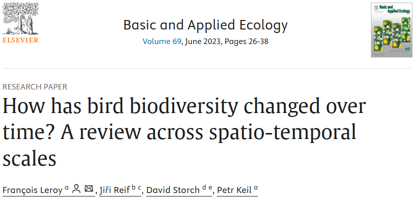
```

$\Rightarrow$ **There is no single answer: it depends on spatial and temporal scales**

]

* Focused on incidence based metric of biodiversity (i.e. species richness, functional richness..., or diversity metrics considering relative abundance)

* Importance of defining and reporting spatio-temporal scales when assessing biodiversity changes

* Local increases and global decreases can be true at the same time: biodiversity changes are scale-dependent phenomenon

---

# <span style="font-size: 0.9em;">Extinction and colonization drive scale-dependence</span>

.center[

**How do extinction and colonization explain species richness scale-dependence?**

```{r, out.width="70%"}
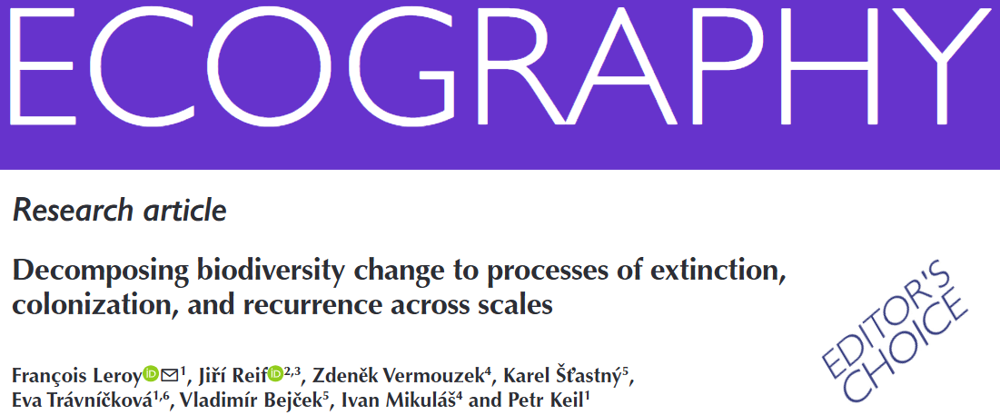
```

]  

<br>

* Empirical analysis of the influence of scales on species richness change ($\Delta S$)

$$\Delta S = C-E$$

* Extinction ($E$) and colonization ($C$) scale differently

* Thus scaling of $\Delta S$ emerges from $C-E$


---

# <span style="font-size: 0.9em;">Extinction and colonization drive scale-dependence</span>

.center[

**Linking theoretical scenarios...**

```{r, out.width="90%"}
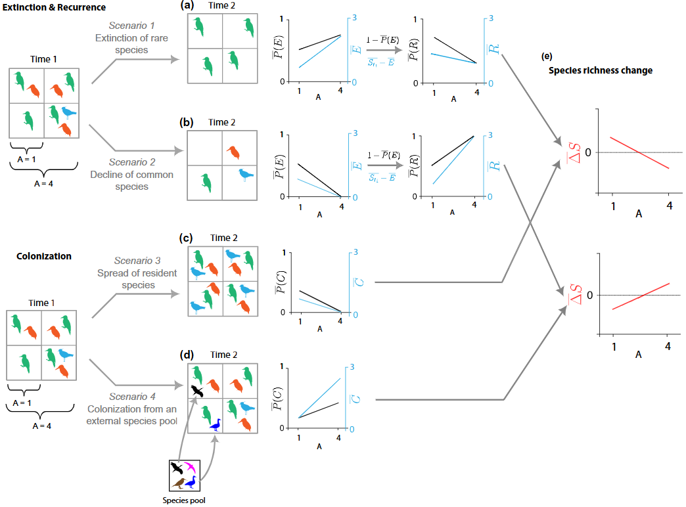
```

]

---


# <span style="font-size: 0.9em;">Extinction and colonization drive scale-dependence</span>

.center[

**... to empirical analyses**

]

.pull-left[

<br>

* Positive scaling of $\Delta S$

<br>

* Increasing colonization = external pool scenario

<br>

* Hump-shape extinction = extinction of rare species at small scales, and decline of common species at large scales

]

.pull-right[

```{r, out.width="80%"}
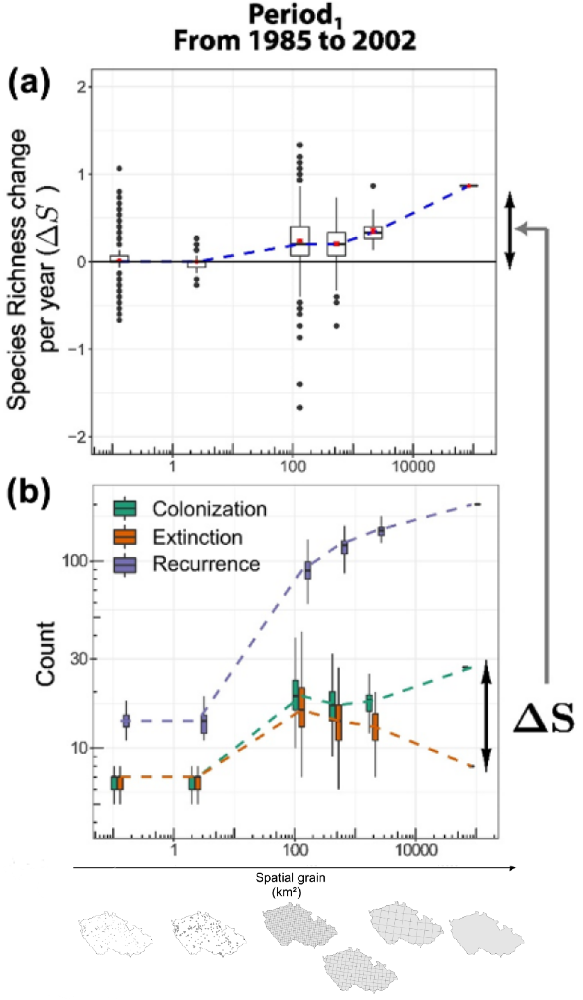
```

]

---

# What controls the scaling of extinction?

.pull-left[

<br><br>

Extinction can be measured as:

* Number of extinct species
* Probability of extinction per species

]

.pull-right[

```{r, out.width="75%"}
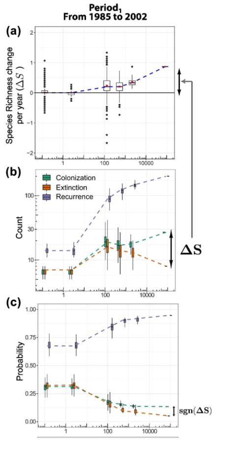
```

]

---

# What controls the scaling of extinction?

.center[

```{r, out.width="80%"}
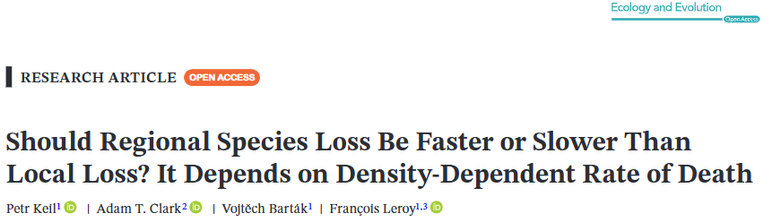
```

]

* Going deeper into the underlying mechanisms of extinction scaling

* Simulation analyses with different processes driving the scaling of extinction: density dependent mortality and drivers of Species-Area Relationship (SAR)

* 3 hypothesis

---

# What controls the scaling of extinction?

```{r}
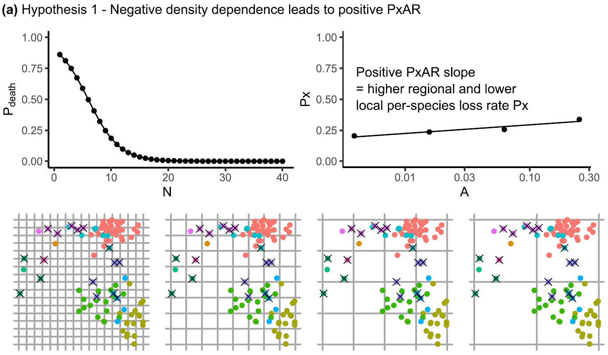
```

---

# What controls the scaling of extinction?

```{r}
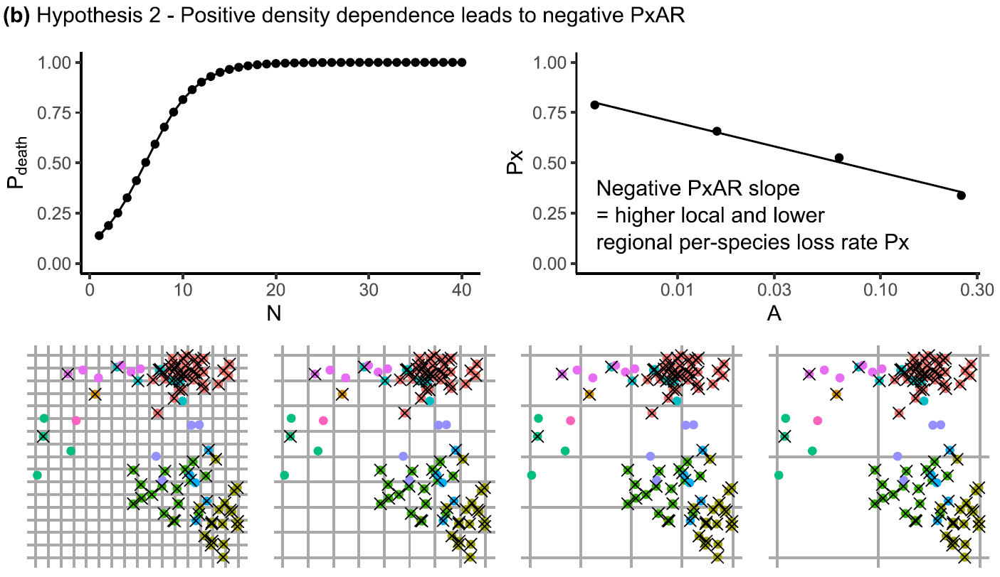
```

<!---

# What controls the scaling of extinction?

<br><br>

```{r}
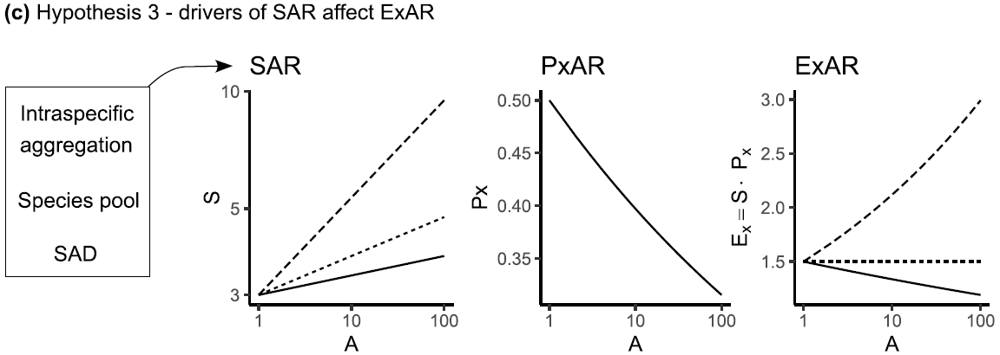
```
-->
---

# What controls the scaling of extinction?

* Density dependence drives extinction scaling

* But effects depend on community structure (SAD)

* Hypotheses hold in uneven communities

.center[

```{r, out.width="60%"}
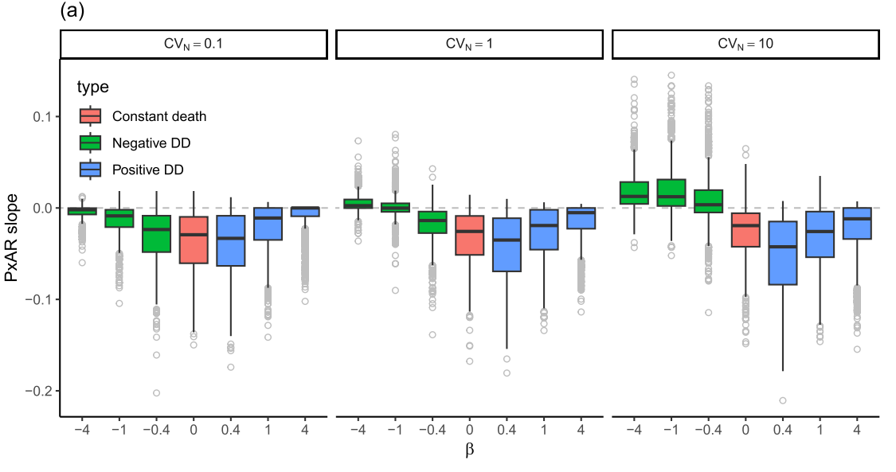
```

```{r, out.width="60%"}
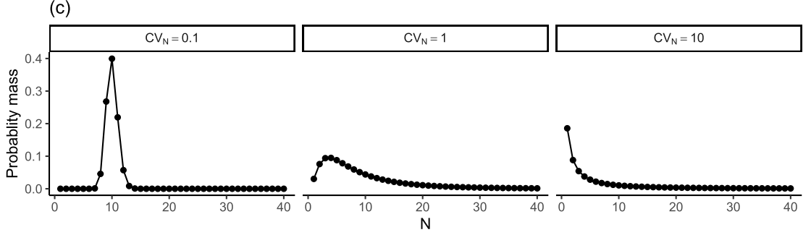
```

]

---

# What controls the scaling of extinction?

.pull-left[

### Depends on:

- Density dependence
- Species abundance distribution (SAD)  
- Species–area relationship (SAR)

]

.pull-right[

### Key insight

<br>

$\Rightarrow$ No universal scaling of extinction

<br>

$\Rightarrow$ Scaling emerges from population processes

]

.center[

<br><br>

### Extinction is not geometric: it is mechanistic

]

---

# The Great Acceleration

* Homo sapiens, like every other species, has an impact on its environment

* Since the 50's: not only linear increase but **acceleration** of human activities

.pull-left[

```{r, out.width="100%"}
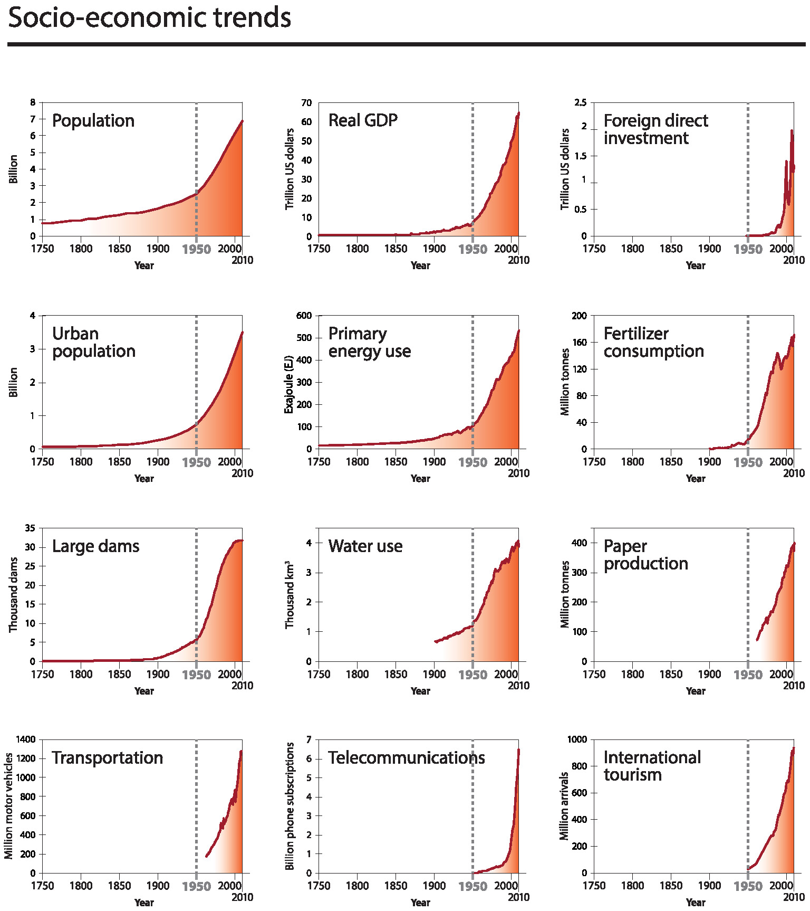
```

]

.pull-right[

```{r, out.width="100%"}
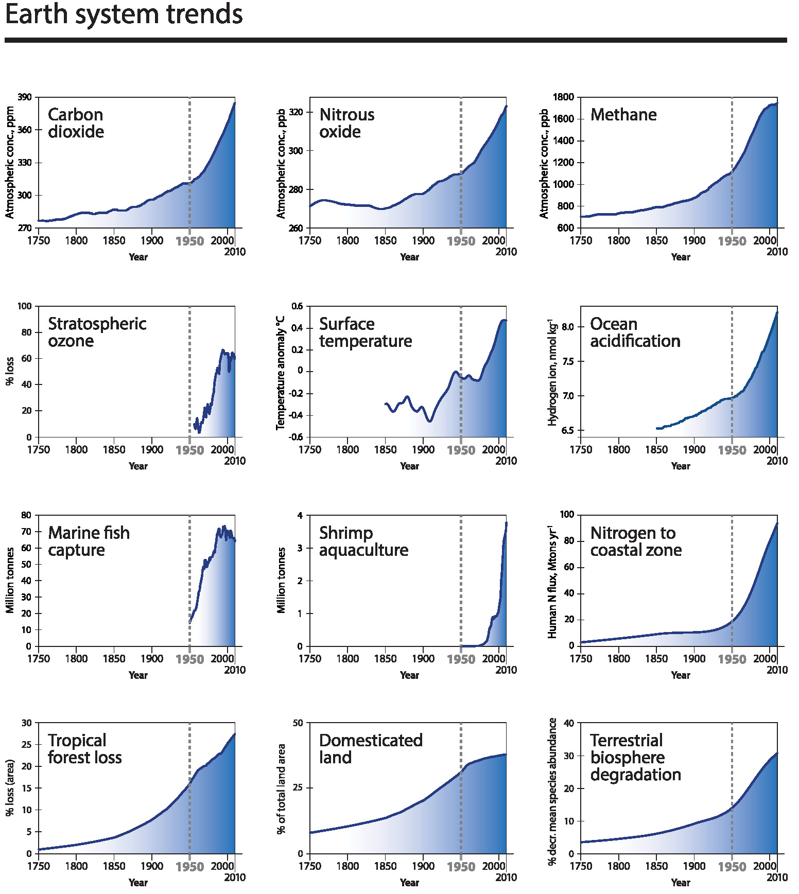
```

]

.footnote[*Steffen et al., 2015*]

---

# The Great Acceleration
* Homo sapiens, like all species, modifies its environment

* Since the 1950s, human activities have not only increased, but **accelerated**

<br>

* Consequences for biodiversity?

.center[

$\Rightarrow$ Acceleration in species extinction rate

$\Rightarrow$ Decline in wildlife populations

<br><br>

### Are population declines accelerating?

]

---

# Bird decline in North America

* 3 **billion** bird decline since the 70's 

* Rosenberg et al. (2019): 1 bird out of 4 (25%)

.center[

<br>

```{r, out.width="100%"}
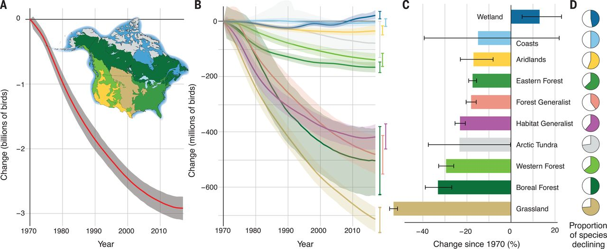
```

]

---

# Bird decline in North America

* 3 **billion** bird decline since the 70's 

* Leroy et al. (2026): 1 bird out of 6 (15%)

.center[

<br>

```{r, out.width="100%"}
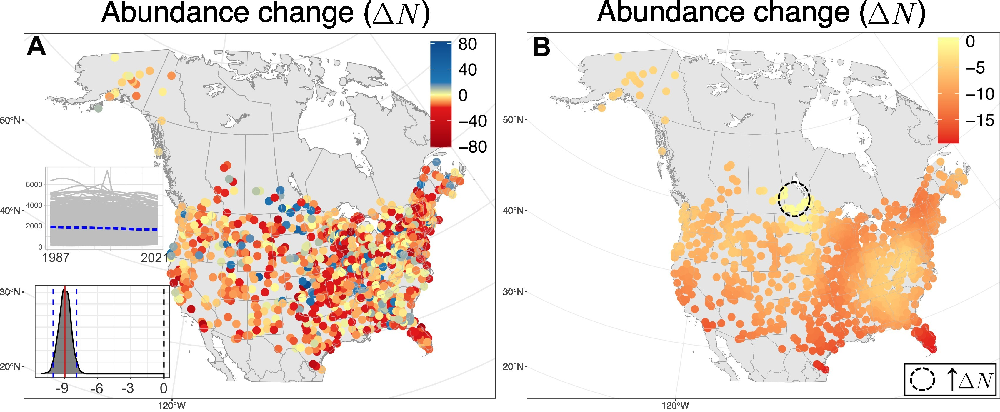
```

]

---

# Patterns of acceleration

* 3 hotspots of accelerating decline: Midwest, California, and Mid Atlantic region

.center[

<br>

```{r, out.width="100%"}
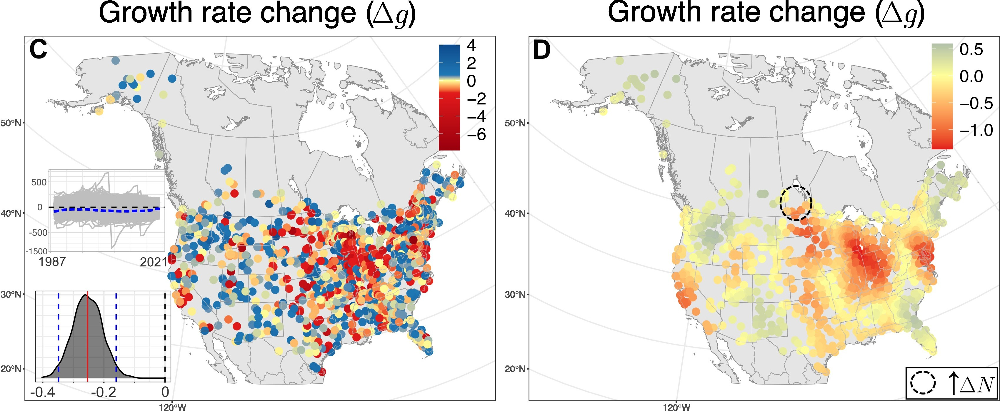
```

]

---

# Drivers of accelerating decline

* Variable importance and partial dependence plots of best performing ML algorithm (RF, BRT, XGBoost) 

.center[

```{r, out.width="80%"}
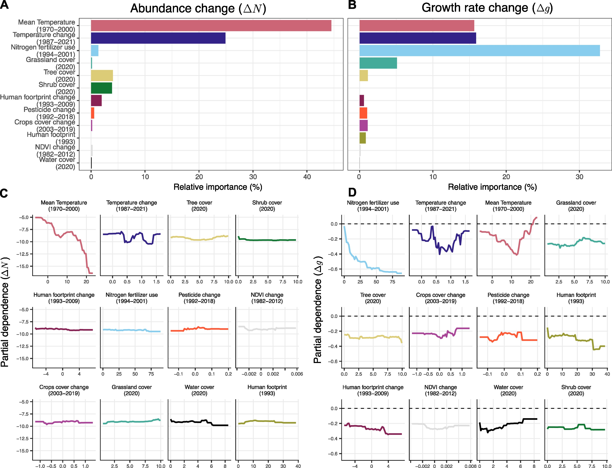
```

]

---

# Taxonomic analysis

* Decomposition into $\Delta N$ and $\Delta g$

.center[

```{r, out.width="75%"}
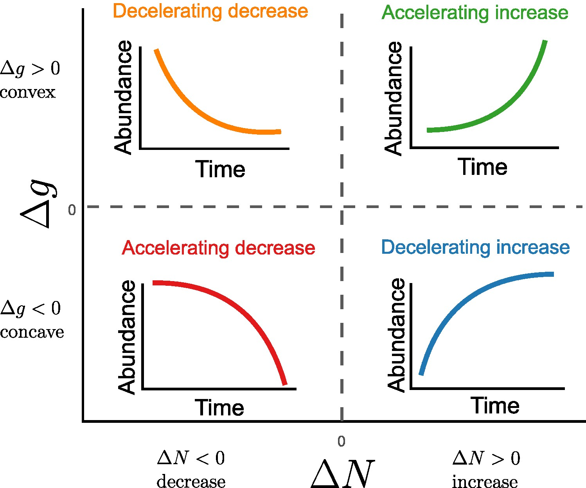
```

]

---

# Taxonomic analysis

* 47% species and 39% families with significant decline

* Among declining taxa: twice more accelerating than decelerating

<br>

.center[

```{r}
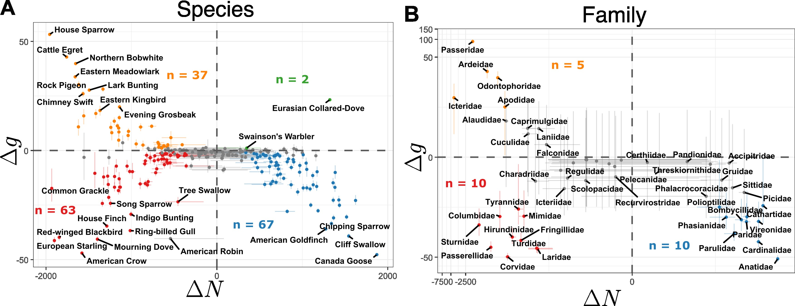
```


]

---

# Media coverage

.pull-left[

<br><br><br>

* The New York Times (front page)
* The Washington Post
* Associated Press
* Le Monde
* NPR
* Radio-Canada
...

]

.pull-right[

```{r, out.width="90%"}

```


]

---

# Decomposing abundance change

* To better understand decline in wildlife population, we can decompose $\Delta N$ into underlying demographic processes: survival $S$, recruitment $R$, and loss $L$

.center[

```{r, out.width="80%"}
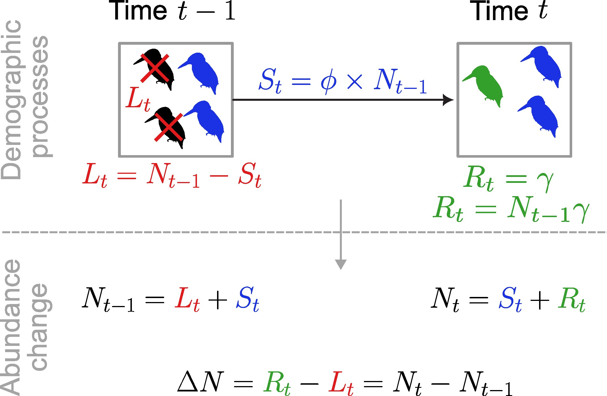
```


]

---

# Decomposing abundance change

<div class="center" style="margin:0;">
  <h2 style="margin:0 0 0em; line-height:1.05; display:inline-block;">
    Problem
  </h2>
</div>

.pull-left[


* Data for demographic rates models are per individual (i.e. *individual encounter history data*)

* They are costly in resources and time

* Individual identification is not equal for all taxa

* Can be invasive/traumatic

* Limited spatial and temporal extent

]

.pull-right[

<div style="margin-right:-3.5em">

```{r, out.width="100%"}
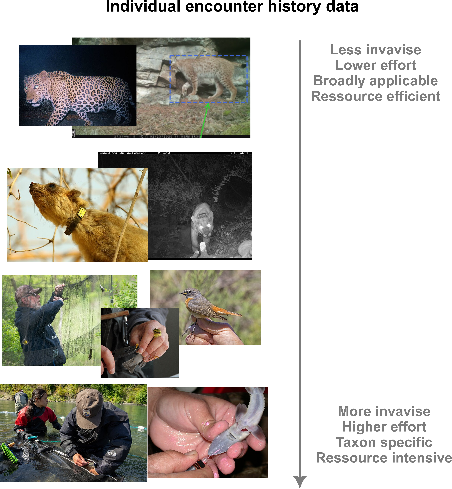
```

]

---

# Beyond abundance change

<div class="center" style="margin:0;">
  <h2 style="margin:0 0 0em; line-height:1.05; display:inline-block;">
    Using abundance to infer demographic rates
  </h2>
</div>

.pull-left[

* However, abundance data are available at large spatial and temporal scale

* The idea of inferring birth/immigration ($\mu$) and death/emigration ($\lambda$) from experimental data is not new

* While overall change in abundance gives information about $\lambda-\mu$, the volatility of the time-series provide information about $\lambda+\mu$ making $\lambda$ and $\mu$ identifiable

]

.pull-right[

<br>

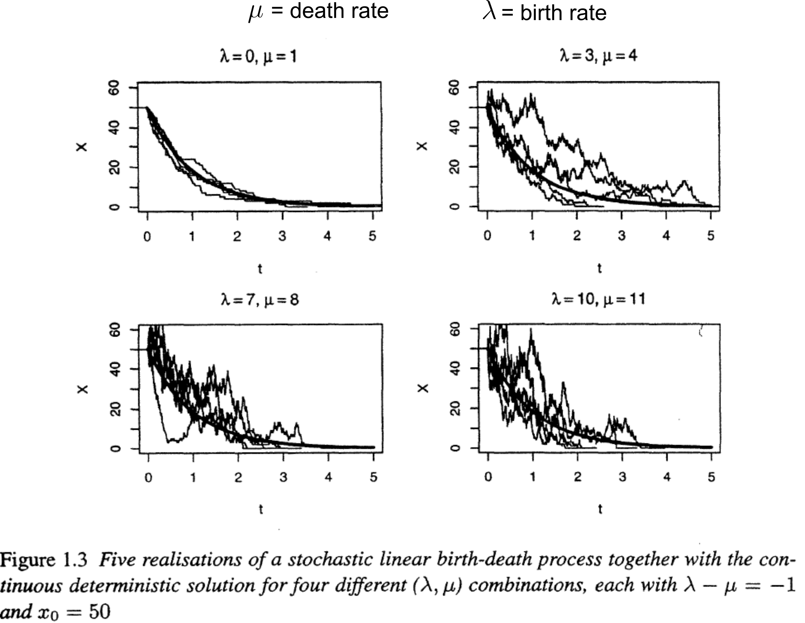


]

.footnote[Wilkinson, 2011]

---

# Dynamic N-mixture model

<div class="center" style="margin:0;">
  <h2 style="margin:0 0 0em; line-height:1.05; display:inline-block;">
    Hidden Markov Model
  </h2>
</div>

**Observation process**

.pull-left[

$$y_{i,j,t} \sim Binomial(N_{i,t}, p)$$

]

.pull-right[

$y =$ observed abundance<br>
$N_{it} =$ latent "true" abundance<br>
$p =$ detection probability

]

.footnote[Dail & Madsen, 2011]

--

**State process**

.pull-left[

$$S_{i,t+1} \sim Binomial(N_{i,t}, \phi_{i,t})\\
R_{i,t+1} \sim Poisson(\gamma_{i,t})\\
N_{i,t+1} = S_{i,t+1} + R_{i,t+1}$$

<br>

<!-- $$N_{i,1} \sim Poisson(\lambda)$$ -->

]

.pull-right[

$\phi =$ survival probability<br>
$\gamma =$ number of recruits

<br><br>

<!-- $\lambda =$ abundance at $t = 1$ -->

]

.footnote[Dail & Madsen, 2011]

---

# Dynamic N-mixture model

<div class="center" style="margin:0;">
  <h2 style="margin:0 0 0em; line-height:1.05; display:inline-block;">
    Hidden Markov Model
  </h2>
</div>

**Observation process**

.pull-left[

$$y_{i,j,t} \sim Binomial(N_{i,t}, p)$$

]

.pull-right[

$y =$ observed abundance<br>
$N_{it} =$ latent "true" abundance<br>
$p =$ detection probability

]

**State process**

.pull-left[

$$S_{i,t+1} \sim Binomial(N_{i,t}, \phi_{i,t})\\
R_{i,t+1} \sim Poisson(\gamma_{i,t})\\
N_{i,t+1} = S_{i,t+1} + R_{i,t+1}$$

<br>

$$N_{i,1} \sim Poisson(\lambda)$$

]

.pull-right[

$\phi =$ survival probability<br>
$\gamma =$ number of recruits

<br><br>

$\lambda =$ abundance at $t = 1$

]

.footnote[Dail & Madsen, 2011]

---

# Limitations of Existing Frameworks

.pull-left[

**Limitations of hierarchical framework**

* Linear or simple polynomial effects of covariates, even though true ecological responses are often unknown *a priori*

* MCMC algorithm scales poorly because inherently sequential, little possibility of parallelization

* Sensitive to priors and initial values

]

.pull-right[

**Limitations of Neural Networks**

* Usually lack inferential power, making it less relevant for ecological insights

* Doesn't distinguish between ecological process and imperfect detection

]

--

.center[

```{r, out.width="70%"}
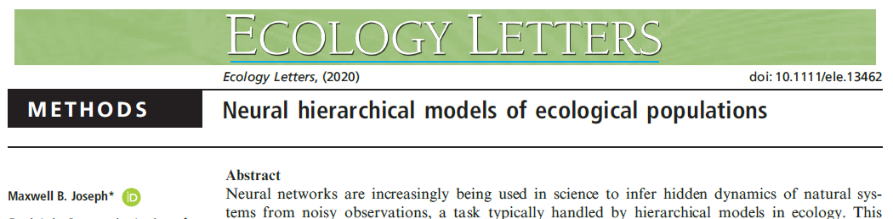
```

]

---

# Neural hierarchical model

.center[

```{r, out.width="90%"}

```

]

<br>

* Combines flexibility and scalability of neural networks with the inferential power of hierarchical models

* Combines decades of development in hierarchical modelling for ecological data with the flexibility and predictive power of Neural Networks

* Loss function: tailored from the model's specific Likelihood (i.e. negative log-likelihood)

* Output activation function according to the parameter to infer

---

# Neural Dynamic N-mixture model

<div class="center" style="margin:0;">
  <h2 style="font-size: 1.5em; margin:0 0 0em; line-height:1.05; display:inline-block;">
    Neural implementation of the dynamic N-mixture model (simplified)
  </h2>
</div>


<div style="margin-right:-3.5em">

<br>

.center[

```{r, out.width= "90%"}
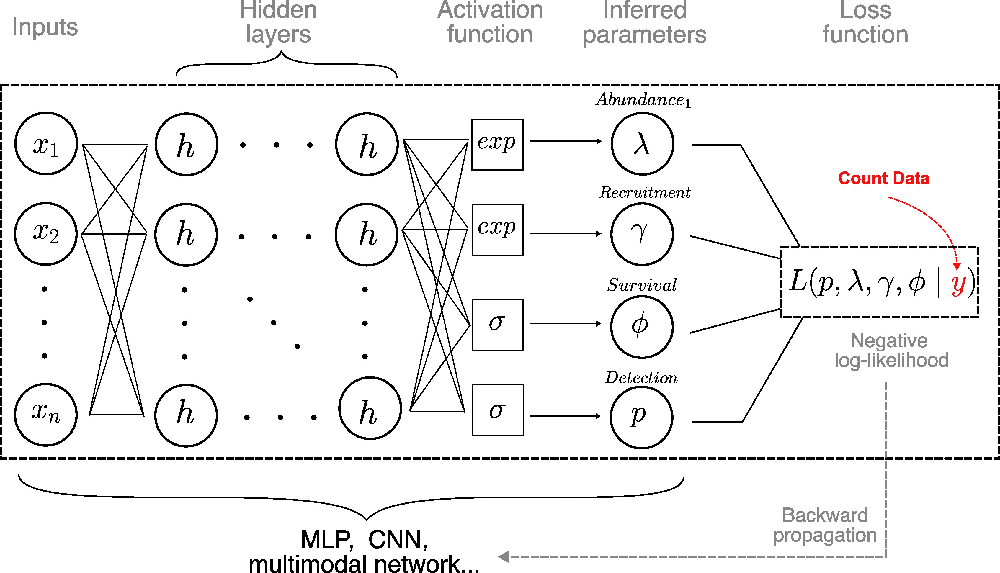
```

]

---

# Example with the N-mixture model

**Observation process**

$$\begin{align*}
& y_{i,j,t} \sim Binomial(N_{i,t}, p)
\end{align*}$$

**State process**

$$\begin{align*}
& N_{i} \sim Poisson(\lambda)
\end{align*}$$

--

<br>

**Integrated likelihood:**

<br>

$$\begin{align*} &\hfill L\!\left(p,\lambda \mid y_{it} \right) = \prod_{i=1}^{R} \left( \sum_{N_i = 0}^{\infty} \left( \prod_{t=1}^{T} Bin \!\left(y_{it}; N_i, p\right) \right) Pois \!\left(N_i;\lambda\right) \right) \end{align*}$$

---

# Example with the N-mixture model

**Observation process**

$$\begin{align*}
& y_{i,j,t} \sim Binomial(N_{i,t}, p)
\end{align*}$$

**State process**

$$\begin{align*}
& N_{i} \sim Poisson(\lambda)
\end{align*}$$

<br>

**Integrated likelihood:**

<br>

$$\begin{align*} &\hfill L\!\left(p,\lambda \mid y_{it} \right) = \prod_{i=1}^{R} \left( \sum_{N_i = 0}^{K} \left( \prod_{t=1}^{T} Bin \!\left(y_{it}; N_i, p\right) \right) Pois \!\left(N_i;\lambda\right) \right) \end{align*}$$

<br>

* Marginalize over $K >> y_{it}$

---

# Dynamic N-mixture model

**State process**

$$\begin{align*}
& N_{i,1} \sim Poisson(\lambda)\\
& R_{i,t+1} \sim Poisson(\gamma_{i,t})\\
& S_{i,t+1} \sim Binomial(N_{i,t}, \phi_{i,t})\\
& N_{i,t+1} = S_{i,t+1} + R_{i,t+1}
\end{align*}$$

**Observation process**

$$\begin{align*}
& y_{i,j,t} \sim Binomial(N_{i,t}, p)
\end{align*}$$

--

**Integrated likelihood**

$$\mathcal{L}(p, \lambda, \gamma, \phi \mid y_{it}) =
\prod_{i=1}^{R} \left[
  \sum_{N_{i1} = 0}^{\infty} \cdots \sum_{N_{iT} = 0}^{\infty}
  \left\{
  \left(
    \prod_{t=1}^{T} Bin(y_{it}; N_{it}, p)
  \right)\\
  \times Pois(N_{i1}; \lambda)
  \cdot \prod_{t=2}^{T} P_{N_{it}, N_{it+1}}
  \right\}
\right]$$

---

# Dynamic N-mixture model

**State process**

$$\begin{align*}
& N_{i,1} \sim Poisson(\lambda)\\
& R_{i,t+1} \sim Poisson(\gamma_{i,t})\\
& S_{i,t+1} \sim Binomial(N_{i,t}, \phi_{i,t})\\
& N_{i,t+1} = S_{i,t+1} + R_{i,t+1}
\end{align*}$$

**Observation process**

$$\begin{align*}
& y_{i,j,t} \sim Binomial(N_{i,t}, p)
\end{align*}$$

**Integrated likelihood**

$$\mathcal{L}(p, \lambda, \gamma, \phi \mid y_{it}) =
\prod_{i=1}^{R} \left[
  \sum_{N_{i1} = 0}^{K} \cdots \sum_{N_{iT} = 0}^{K}
  \left\{
  \left(
    \prod_{t=1}^{T} Bin(y_{it}; N_{it}, p)
  \right)\\
  \times Pois(N_{i1}; \lambda)
  \cdot \prod_{t=2}^{T} P_{N_{it}, N_{it+1}}
  \right\}
\right]$$

---

# Transition matrix

* Key part of Hidden Markov Models

* Involves the transition between abundance at time $t$ and $t+1$ and the demographic parameters

* Each element of the transition matrix $P$ represents the transition probability from state $N_{it} = j$ to state $N_{it+1} = k$ with the discrete convolution:

$$P_{jk} = \sum_{c=0}^{\min(j, k)} Bin(c; j, \phi) \cdot Pois(k - c; \gamma)$$

--


$$\begin{array}{c@{\qquad}c}
N_{i,t} &
\begin{array}{c}
\scriptstyle N_{i,t+1} \\[-0.3ex]
\begin{bmatrix}
P_{K0} & P_{K1} & P_{K2} & \cdots & P_{KK} \\
\vdots & \vdots & \vdots & \ddots & \vdots \\
P_{20} & P_{21} & P_{22} & \cdots & P_{2K} \\
P_{10} & P_{11} & P_{12} & \cdots & P_{1K} \\
P_{00} & P_{01} & P_{02} & \cdots & P_{0K}
\end{bmatrix}
\end{array}
\end{array}$$

---

# Transition matrix

.center[

```{r, out.width="80%"}
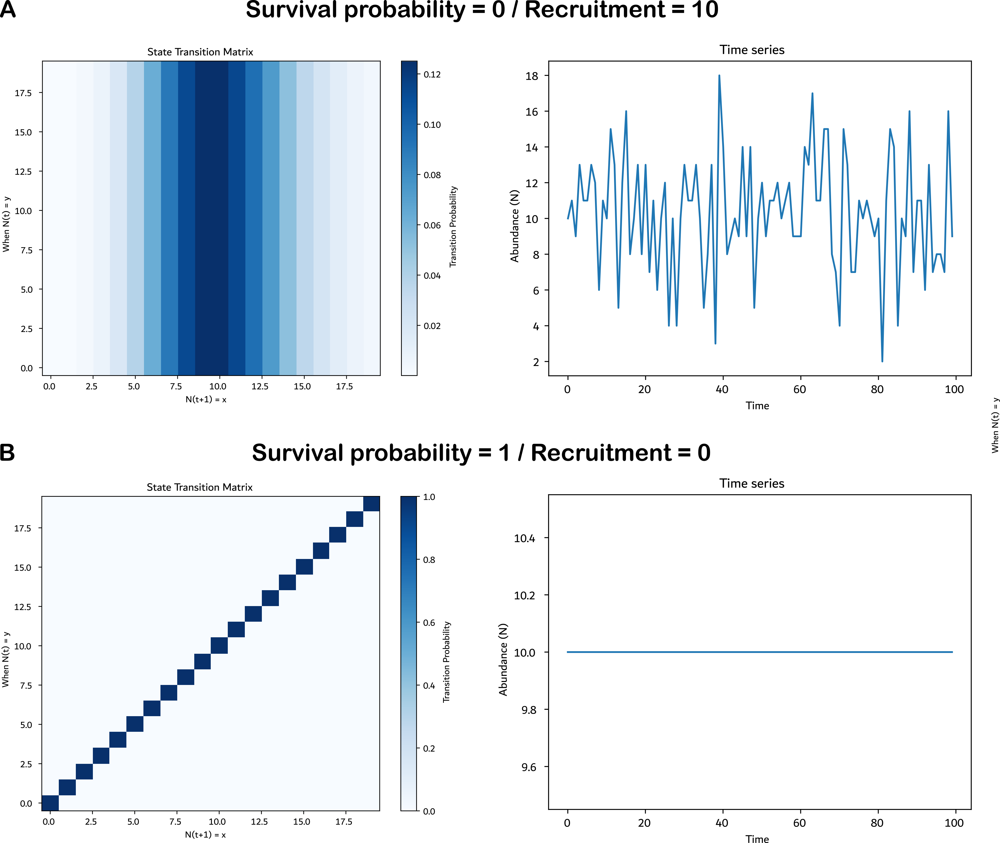
```

]

---

# Transition matrix

<br><br>

.center[

```{r}
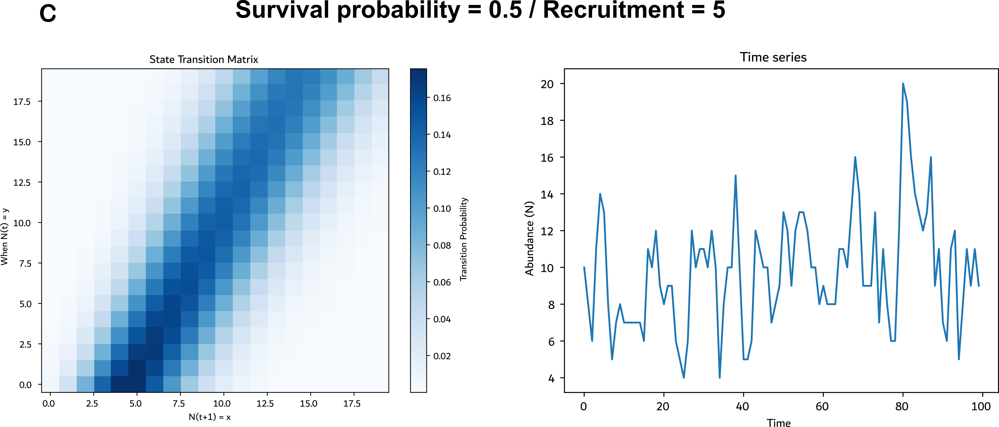
```


]


---

# Transition matrix - Optimization

* One transition matrix **per time step and per time-series** $\Rightarrow$ Bottleneck

$$P_{jk} = \sum_{c=0}^{\min(j, k)} Bin(c; j, \phi) \cdot Pois(k - c; \gamma)$$
$$\begin{array}{c@{\qquad}c}
N_{i,t} &
\begin{array}{c}
\scriptstyle N_{i,t+1} \\[-0.3ex]
\begin{bmatrix}
P_{K0} & P_{K1} & P_{K2} & \cdots & P_{KK} \\
\vdots & \vdots & \vdots & \ddots & \vdots \\
P_{20} & P_{21} & P_{22} & \cdots & P_{2K} \\
P_{10} & P_{11} & P_{12} & \cdots & P_{1K} \\
P_{00} & P_{01} & P_{02} & \cdots & P_{0K}
\end{bmatrix}
\end{array}
\end{array}$$

* **Fast, heavy memory implementation:** vectorisation of $P$ over every time steps and batch size

* **Time gain:** e.g. from 88 minutes in Bayesian framework (JAGS) to ca. 15 minutes with this implementation (8GB VRAM, 300 epochs)

---

# Benchmarking our neural implementation

* Simulate data under the dynamic N-mixture model

* Use one covariate x with quadratic relationships for $\lambda$, $\phi$, $\gamma$, and $p$

* Simulate: latent states $N$, $S$, $R$, and repeated counts

.center[

```{r, out.width="70%"}
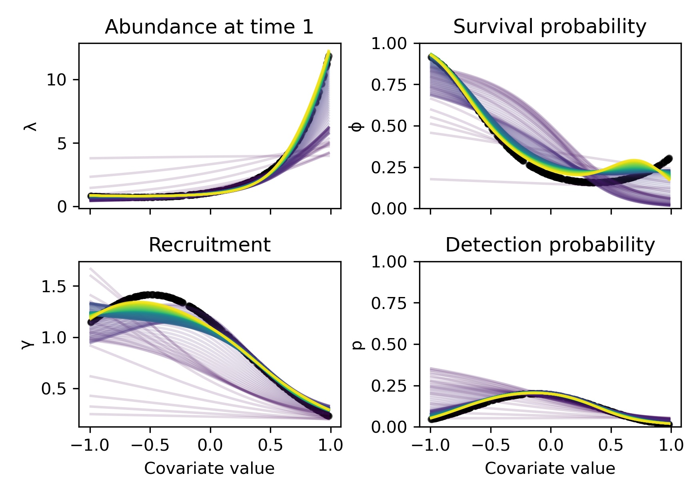
```

]


---

# Benchmarking our neural implementation

* Fit the same simulated data with:

  - Neural Network framework
  - Bayesian framework

.center[

```{r, out.width="80%"}
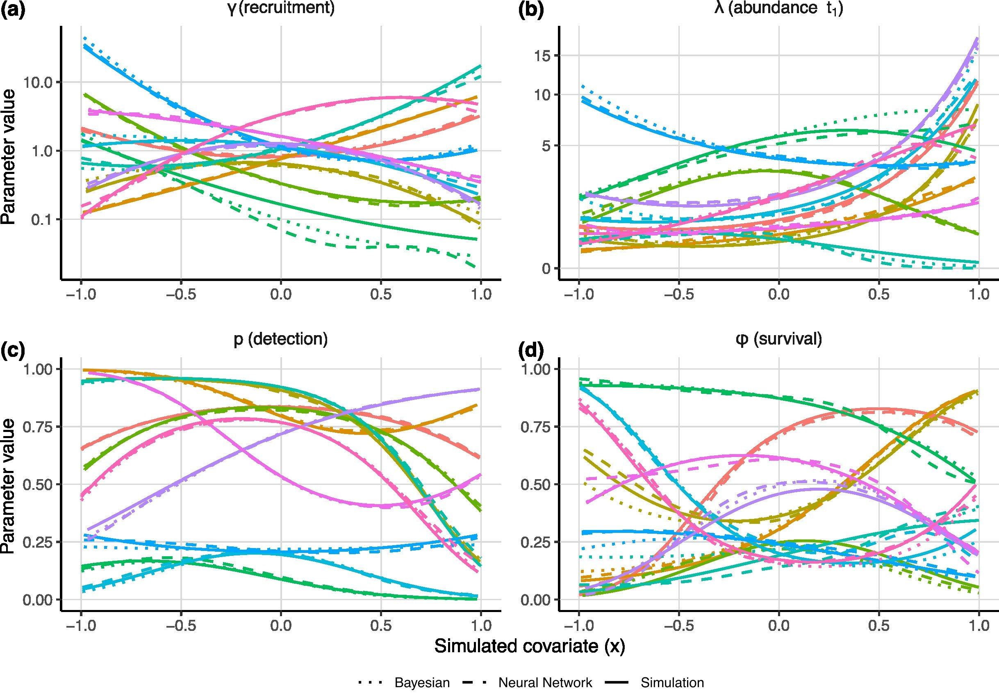
```

]

---

# Benchmarking our neural implementation

.pull-left[

<br><br>

* Estimates of N, S, R

* Better performance of Neural Network

* Surprising because it represents the best case scenario for the Bayesian implementation


]

.pull-right[

<div style="margin-right:-3.5em">

```{r}
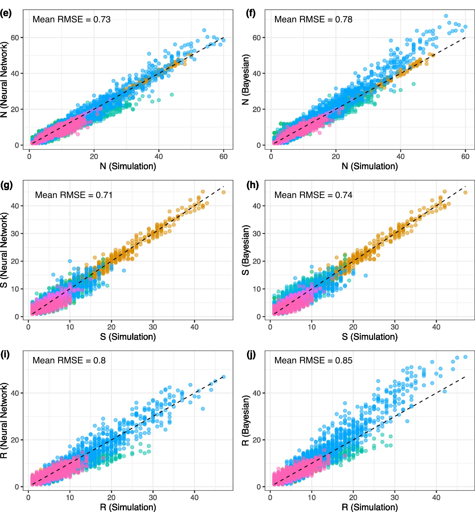
```


]

---

# Computer vision

* Fit the same simulated data with a Convolutional Neural Network

.center[

```{r, out.width="80%"}
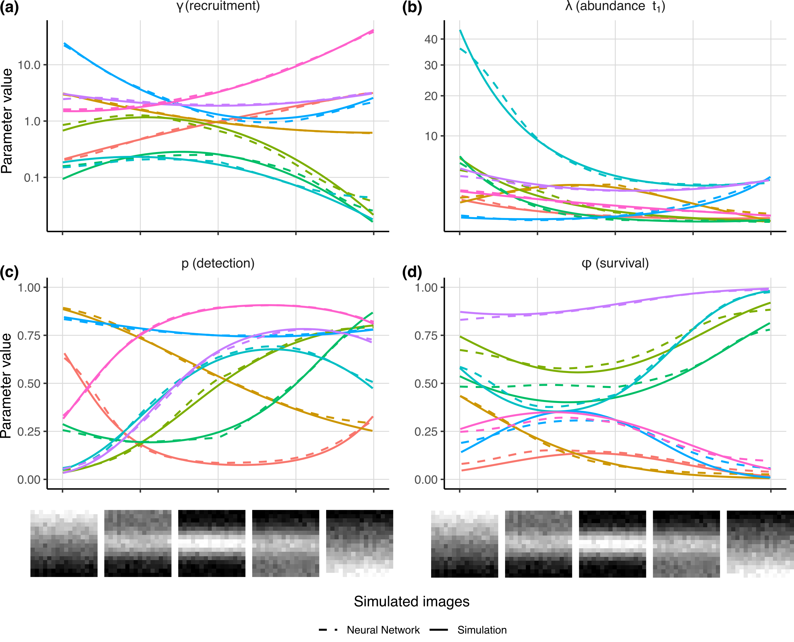
```


]

---

# Case study

* The Swiss Green Woodpecker 

* Conditional effect plots 

.center[


```{r, out.width="80%"}
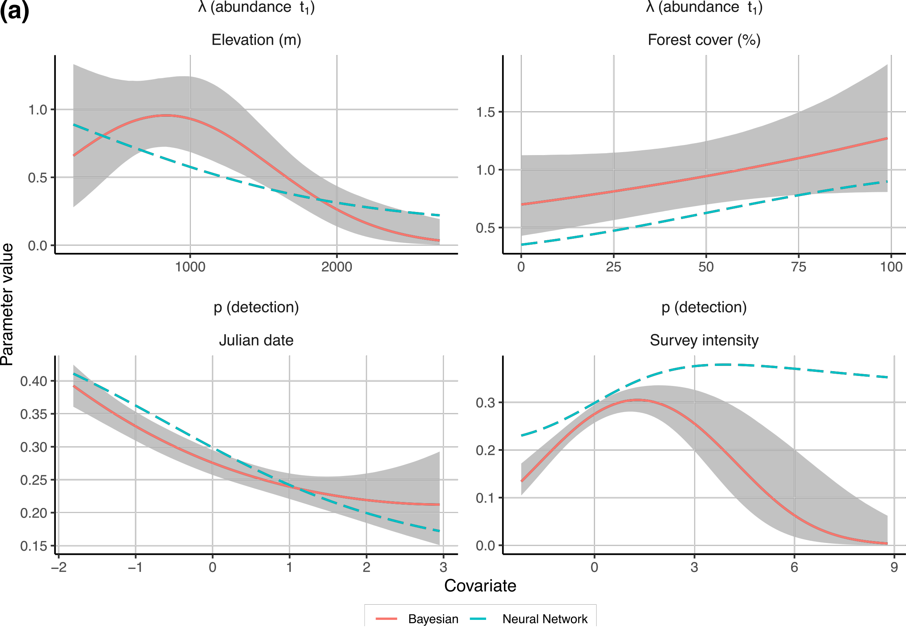
```

]


---

<h1 style="font-size: 2.5em;">
  Neural dynamic N-mixture model: main takeaways
</h1>

.pull-left[

### Main result

- Flexible alternative to Bayesian dynamic N-mixture models

- Recovers:
  - ecological parameters
  - latent states $N$, $S$, $R$

- Comparable or better recovery than JAGS in simulations

]

.pull-right[

### Computational gain

- Uses gradient-based optimization

- Efficient GPU parallelization

- Much faster fitting than MCMC

]

.center[

<br><br>

### Faster and more flexible inference of latent ecological processes

]

---


# Limits and next steps


.pull-left[

### Current limits

- Memory cost increases with $N_{max}$

- GPU acceleration is important

- Requires tuning:
  - learning rate
  - batch size
  - regularization

]

.pull-right[

### Next steps

- Sparse / banded transition matrices

- Large-count approximations

- Extensions of the Dail–Madsen model

- Integration of high-dimensional data  
  e.g. remote sensing

]

.center[

<br>

### Main bottleneck: scaling to large-count systems

]

---

# &emsp;&emsp;&emsp;&emsp;Acknowledgements

.center[

```{r, out.width="92%"}

```

]
